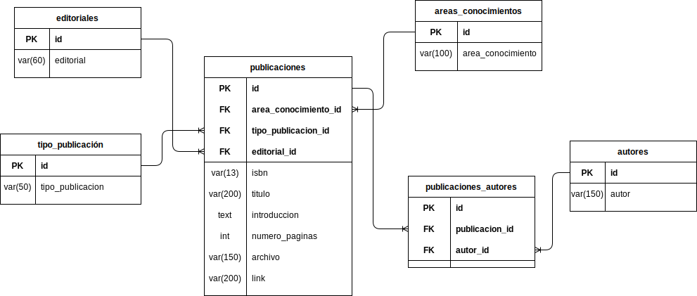

# Esquema: biblioteca

En este archivo se describen las tablas y sus átributos definidos en el esquema de biblioteca.

- [Esquema: biblioteca](#esquema-biblioteca)
  - [Atributos obligatorios](#atributos-obligatorios)
- [Tablas](#tablas)
    - [areas_conocimientos](#areas_conocimientos)
    - [tipos_publicaciones](#tipos_publicaciones)
    - [autores](#autores)
    - [editoriales](#editoriales)
    - [publicaciones](#publicaciones)
    - [publicaciones_autores](#publicaciones_autores)

## Atributos obligatorios

Nota: Todas las tablas de este esquema deben contar con los siguientes 3 atributos.

| tipo      |  atributo   | Nulo | descripción                                                                              |
| :-------- | :---------: | :--: | :--------------------------------------------------------------------------------------- |
| bool      |   activo    |  No  | campo para confirmar si la fila ha sido eliminada.(false) de no ser el caso sera (true). |
| timestamp | created_att |  No  | campo que indica cuando fue creada la fila                                               |
| timestamp | updated_att |  No  | campo que indica cuando fue la ultima actualización de algún atributo de la tabla        |

# Tablas

### areas_conocimientos

En esta tabla se define el nombre del area al cual pertenece una publicación. Ejemplo: ciencias, matemáticas, geografía, historia, etc.

| tipo         |     atributo      | Nulo | descripción                     |
| :----------- | :---------------: | :--: | :------------------------------ |
| int          |        id         |  No  | Clave primaria                  |
| varchar(100) | area_conocimiento |  No  | Nombre del área de conocimiento |

### tipos_publicaciones

En esta tabla se define los tipos que puedes ser las publicaciones. Ejemplo: libro, revista, diapositiva, pagina web, artículo, etc.

| Tipo        |     Atributo     | Nulo | Descripción                    |
| :---------- | :--------------: | :--: | :----------------------------- |
| int         |        id        |  No  | Clave primaria                 |
| varchar(50) | tipo_publicacion |  No  | Nombre del tipo de publicación |

### autores

En esta tabla se guarda el nombre del autor que realiza una publicación.

| Tipo         | Atributo | Nulo | Descripción                        |
| :----------- | :------: | :--: | :--------------------------------- |
| int          |    id    |  No  | clave primaria                     |
| varchar(150) |  autor   |  No  | nombre del autor de la publicación |

### editoriales

En esta tabla se define el nombre del editorial de la publicación, este en caso de que el tipo de publicación sea un libro.

| Tipo        | Atributo  | Nulo | Descripción          |
| :---------- | :-------: | :--: | :------------------- |
| int         |    id     |  No  | Clave primaria       |
| varchar(60) | editorial |  No  | Nombre del editorial |

### publicaciones

En esta tabla se guardan las publicaciones. Estas pueden ser libros, revistas, artículos, diapositivas, etc. Que estarán disponibles dentro de nuestra biblioteca.

| Tipo         |       Atributo       | Nulo | Descripción                                                                   |
| :----------- | :------------------: | :--: | :---------------------------------------------------------------------------- |
| int          |          id          |  No  | Clave primaria                                                                |
| int          | area_conocimiento_id |  No  | Clave foránea de la tabla areas_conocimientos                                 |
| int          | tipo_publicacion_id  |  No  | Clave foránea de la tabla tipos_publicaciones                                 |
| int          |     editorial_id     |  Si  | Clave foránea de la tabla editoriales                                         |
| varchar(13)  |         isbn         |  Si  | Código de normalización internacional (solo para publicaciones de tipo libro) |
| varchar(200) |        titulo        |  No  | titulo de la publicación                                                      |
| text         |     introduccion     |  No  | Introducción que refleja el contenido del tema de la publicación              |
| int          |    numero_paginas    |  No  | numero de páginas de la publicación                                           |
| varchar(150) |       archivo        |  Si  | nombre del archivo de la publicación. (solo archivos con extension pdf)       |
| varchar(200) |         link         |  Si  | link a un sitio web de la publicación                                         |

### publicaciones_autores

En esta tabla se define el la relación N:N de las tablas publicaciones y autores, donde uno o mas autores pueden tener una o mas publicaciones, como una o mas publicación puede tener uno o mas autores.

| Tipo |    Atributo    | Nulo | Descripción                             |
| :--- | :------------: | :--: | :-------------------------------------- |
| int  |       id       |  No  | Clave primaria                          |
| int  | publicacion_id |  No  | Clave foránea de la tabla publicaciones |
| int  |    autor_id    |  No  | Clave foránea de la tabla autores       |
