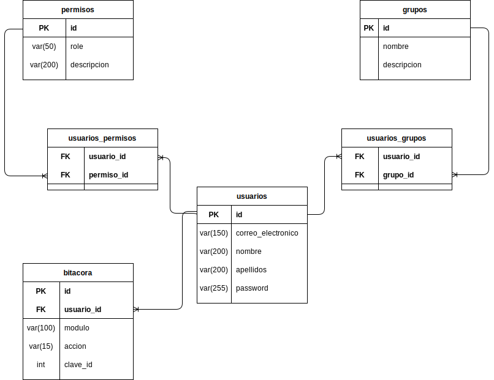

# Esquema: control-seguridad

En este archivo se describen las tablas y sus atributos definidos en el esquema de control-seguridad.

- [Esquema: control-seguridad](#esquema-control-seguridad)
  - [Atributos obligatorios](#atributos-obligatorios)
- [Tablas](#tablas)
    - [permisos](#permisos)
    - [grupos](#grupos)
    - [usuarios](#usuarios)
    - [usuarios_permisos](#usuarios_permisos)
    - [usuarios_grupos](#usuarios_grupos)
    - [bitacora](#bitacora)

## Atributos obligatorios

Nota: Todas las tablas de este esquema deben contar con los siguientes 3 atributos.

| tipo      |  atributo   | Nulo | descripción                                                                              |
| :-------- | :---------: | :--: | :--------------------------------------------------------------------------------------- |
| bool      |   activo    |  No  | campo para confirmar si la fila ha sido eliminada.(false) de no ser el caso sera (true). |
| timestamp | created_att |  No  | campo que indica cuando fue creada la fila                                               |
| timestamp | updated_att |  No  | campo que indica cuando fue la ultima actualización de algún atributo de la tabla        |

# Tablas

### permisos

En esta tabla se define los permisos de acceso para las diferentes acciones definidas dentro del sistema.
**Nota:** La nomenclatura del rol empezara con ROLE_ACCIÓN_TABLA
Ejemplo:
ROLE_CREATE_PUBLICACIONES: permite crear las publicaciones
ROLE_UPDATE_PUBLICACIONES: permite editar las publicaciones
ROLE_SHOW_PUBLICACIONES: permite consultar las publicaciones
ROLE_DELETE_PUBLICACIONES: permite eliminar las publicaciones

| tipo         |  atributo   | Nulo | descripción                                        |
| :----------- | :---------: | :--: | :------------------------------------------------- |
| int          |     id      |  No  | Clave primaria                                     |
| varchar(50)  |    role     |  No  | clave del permiso utilizado por el sistema         |
| varchar(200) | descripcion |  No  | Descripción mas detallada de la acción del permiso |

### grupos

En esta tabla se define los grupos que realizan un conjunto de acciones especificas dentro del sistema.
Ejemplo:
Un Capturista se encarga de subir la publicaciones de la biblioteca. Mientras que un usuario de biblioteca solo consulta las publicaciones que ya estan registradas.
Se puede definir que hay dos grupos: (CAPTURISTA, USUARIO).

| tipo         |  atributo   | Nulo | descripción                                        |
| :----------- | :---------: | :--: | :------------------------------------------------- |
| int          |     id      |  No  | Clave primaria                                     |
| varchar(50)  |   nombre    |  No  | nombre del grupo                                   |
| varchar(200) | descripcion |  No  | Descripción mas detallada de la acción del permiso |

### usuarios

En esta tabla se define los usuarios que tienen acceso al sistema.

| tipo         |      atributo      | Nulo | descripción                            |
| :----------- | :----------------: | :--: | :------------------------------------- |
| int          |         id         |  No  | Clave primaria                         |
| varchar(150) | correo_electronico |  No  | correo electrónico de inicio de sesión |
| varchar(200) |       nombre       |  No  | nombre del usuario                     |
| varchar(200) |     apellidos      |  No  | apellidos del usuario                  |
| varchar(255) |      password      |  No  | contraseña para acceder al sistema     |

### usuarios_permisos

En esta tabla se definen los permisos de un usuario en especifico.
En caso de que se quiera otorgar a un usuario un permiso que no tiene definido en su grupo.

| Tipo |  Atributo  | Nulo | Descripción                            |
| :--- | :--------: | :--: | :------------------------------------- |
| int  |     id     |  No  | Clave primaria                         |
| int  | usuario_id |  No  | Clave foránea de la tabla **usuarios** |
| int  | permiso_id |  No  | Clave foránea de la tabla **permisos** |

### usuarios_grupos

En esta tabla se definen los diferentes grupos que puede pertenecer un usuario. Un usuario puede pertenecer a mas de un grupo.

| Tipo |  Atributo  | Nulo | Descripción                            |
| :--- | :--------: | :--: | :------------------------------------- |
| int  |     id     |  No  | Clave primaria                         |
| int  | usuario_id |  No  | Clave foránea de la tabla **usuarios** |
| int  |  grupo_id  |  No  | Clave foránea de la tabla **grupos**   |

### bitacora

En esta tabla se registran las acciones de cada uno de los usuarios.

**Nota:** El atributo clave_id solo es necesario para acciones que modifican un elemento de la tabla. No es necesario para las acciones que solo consultan información.

| Tipo         |  Atributo  | Nulo | Descripción                                    |
| :----------- | :--------: | :--: | :--------------------------------------------- |
| int          |     id     |  No  | Clave primaria                                 |
| int          | usuario_id |  No  | Clave foránea de la tabla **usuarios**         |
| varchar(100) |   modulo   |  No  | Nombre de la tabla definido dentro del sistema |
| varchar(15)  |   accion   |  No  | acción realizada(CREATE,UPDATE,DELETE,SHOW)    |
| int          |  clave_id  |  Si  | Clave de id que se vio afectado por la acción  |
